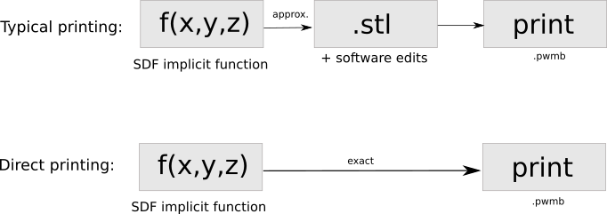

# SLA-Direct-3dPrinting
A python tool for producing a .pwmb file from a function for my printer (AnyCubic Photon Mono X 6K)

#####

#####

## Auto Setup

Run install.sh to download the required tools and packages.
> ./install.sh

When installed, a **tools** **data** folders are created. 

run in the root directory 
> python3 main.py

You only need to define a function in main.py and set other parameters in slicer() function to slice and produce a .pwmb file for your parinting machine (AnyCube Phonton Mono X 64 is the defualt).

## Manually Setup
If you want to manually produce a .pwmb file follow this instruction:
- First, you need .png files (let's say img is the root name, you start from 000 to XXX with the equal name length). The accepted files names are like bellow:
    * img0000.png, img0001.png, ..., img0400.png,         
These .png files should be put in ./data folder and size/resolution should be in consistence with your printers' display. For   AnyCube Phonton Mono X 64 this is 5670*3600.      

- Now, you need to copy and paste **./src/*.ini** files and **thubmnail** in ./data folder. 

- zip all files and folder in ./data and rename it **sample.sl1s**.
- Download https://github.com/sn4k3/UVtools/releases/download/v3.13.1/UVtools_linux-x64_v3.13.1.zip (for linux users) and upzip it in ./tools folder. You need to find **UVtoolsCmd** and call
> ./tools/UVtoolsCmd convert sample.s1 sample.pwmb pwmb
